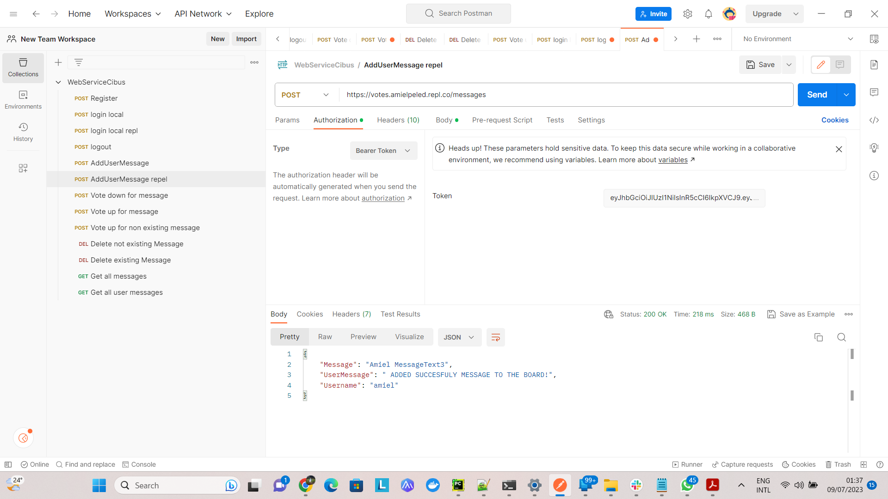

# Web Services Test Cibus

The solution is implemented based on flask python web framework
using:

1)local sqlite3 database 
to store the users info
and messages info in two tables 

2)flask python server
because it's simple to use and implement and supports the requested functionalty

3)JWT for secure login with token
i have used JWT:
Because it's a good way of securely transmitting information between parties
because they can be signed,
which means you can be certain that the senders are who they say they are.
Additionally, the structure of a JWT allows you to verify that the content hasn't been tampered with.

Implemented:
Unit tests
Docker File to run server as docker container
Error Handaling for the requests

in addition a github actions workflow to build and run docker server and run the tests(on github)
So you can run the serve(using build & run docker commands)
and the tests
from this link:
https://github.com/amielnoy/WebServiceTestCibus/actions/workflows/docker-image.yml

## To run the web services:

## 1)Open the project in PyCharm community edition
  define virtual env
  choose python 3.10 and above
  Install:JWT
pip install Flask-JWT-Extended
## 2)Run the Server.

There are two options,

1. ###   Run Python Script
    From root folder of the project on cli(windows):
    
`  python app.py`
  
2. ###   Using docker commands:

    From root folder of the project on terminal(windows):
    
    `runDocker.bat`

# **To run and test the various web services:**
Pay attention the server was published to the repl 
website!

To run the requests from server published to repl

use the folowing postman collection,

import to postman the postman requests collection
**`WebServiceCibus.postman_collection_repl.json`**

located at the root of the project
and run the requests to test the webservices

Pay attention to first get access token using Login request

and use the access_token value 
in the header as bearer token

from postman

to install postman:
https://www.postman.com/downloads/
# **To run the unit tests:**

from the project root
**Run on terminal:**

`pytest web_services_tests.py`

